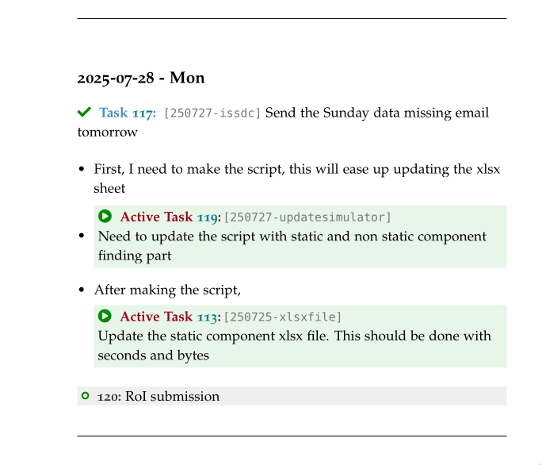

# LaTeX Journal & Task Management System

This project provides a sophisticated, automated system for maintaining a personal journal, project log, or "second brain" using LaTeX. It is built upon the elegant `tufte-book` class and features a powerful task management system with automatic list generation, task counting, cross-referencing, tagging, and metadata.

The workflow is streamlined by a companion shell script that automates the creation of daily entry files.




---

## ✨ Features

- **Daily Journaling:** Automatically create a new `.tex` file for each day's entry.
- **Structured Task Management:** Define tasks as `\todo`, important (`\imp`), or backlog items.
- **Task Metadata:** Add rich metadata to tasks, including:
  - `done`: Mark tasks as complete.
  - `doing`: Mark tasks as active.
  - `ignore`: Mark tasks as ignored.
  - `label`: Assign a unique, permanent label for cross-referencing.
  - `donedate`: Record the completion date.
  - `marker`: Add custom tags or markers (e.g., `[REVIEW]`, `[API]`, `\faBook`).
  - `eisen`: Eisenhower matrix category (`do`, `decide`, `delegate`, `delete`).
  - `tag`: Add one or more tags for grouping/filtering.
- **Automatic Summary Lists:** The system automatically generates separate, hyperlinked chapters for:
  - List of Active Tasks 
  - List of Todos (Pending Tasks), grouped by Eisenhower category
  - List of Done Tasks
  - List of Ignored Tasks
  - List of Meetings
- **Automatic Task Counting:** The summary lists prominently display the total count of pending, active, ignored, and completed tasks.
- **Unique & Referable Tasks:** Each daily entry file uses a date-based prefix, ensuring that labels like `setup` become unique (e.g., `231026-setup`) and can be safely referenced from anywhere in the document.
- **Tagging System:** Tasks can be tagged and later listed by tag using `\showtag{tagname}`.
- **Elegant Typography:** Leverages the `tufte-book` class for a clean, professional, and readable layout.
- **Customizable Theming:** All colors for tasks, icons, and backgrounds are defined in `main.tex` and can be easily customized.

---

## ⚙️ Prerequisites

- **A TeX Distribution:** You need a full LaTeX installation, such as TeX Live, MiKTeX, or MacTeX.
- **Required LaTeX Packages:** The system relies on several packages. The companion `journal.sh` script can check for them, but you must ensure they are installed. Key packages include:
  - `tufte-book`
  - `fontawesome5` (for icons like ✔ and ○)
  - `xcolor`, `keyval`, `hyperref`, `etoolbox`, `calc`, `enumitem`, `fancyhdr`, `refcount`, `ulem`
- **A bash compatible shell:** For using the helper script.
- **curl:** Required by the script to download the `main.tex` template on first run.

---

## 🗂️ File Structure

The system is designed to work with a specific directory structure, which the helper script will create for you.

```
~/git/personal/secondbrain/
├── main.tex            # The main LaTeX file (the template). Do not edit daily.
├── entries.tex         # An index file that \input's all daily entries.
└── entries/
    ├── 2023-10-25.tex  # An entry file for a specific day.
    ├── 2023-10-26.tex  # This is where you write your tasks.
    └── ...
```

---

## 🚀 Workflow

The intended workflow is simple and designed to get you writing as quickly as possible:

1. Open your terminal and navigate to your project directory.
2. Run the helper script:
   ```bash
   ./wj
   ```
   The script will:
   - Download `main.tex` on first run.
   - Create a new file `entries/YYYY-MM-DD.tex` for the current date.
   - Add an entry to `entries.tex` to include this new file in the main document.
   - Open the new daily file in your editor (e.g., `nvim`).
3. Write your tasks in the daily file using the commands detailed below.
4. Compile the PDF (twice for references and lists):
   ```bash
   pdflatex main.tex
   pdflatex main.tex
   ```
5. You can always add the `wj` file to your `~/.local/bin/` folder for easy calling the file. 

---

## 📋 Task Commands Documentation

### Task Creation

These are the primary commands you will use to create tasks. They all accept the same set of optional arguments.

| Command         | Purpose                                 | List            | Color      |
|-----------------|-----------------------------------------|-----------------|------------|
| `\todo{...}`    | A standard task for today.              | List of Todos   | Dark Gray  |
| `\imp{...}`     | An important/high-priority task.        | List of Todos   | Red        |
| `\subtodo{...}` | A sub-task nested under a `\todo`.      | List of Todos   | Dark Gray  |
| `\activetask{label}` | Mark a labeled task as active      | List of Active  | Green      |
| `\note{...}`    | Add a margin note.                      | -               | Green      |
| `\thought{...}` | Add a thought (gray italic).            | -               | Gray       |

#### Task Options (Key-Value Pairs)

You can pass options to any task creation command in square brackets `[]`.

- **done:** Marks a task as complete. It will be moved to the "List of Done Tasks".
- **doing:** Marks a task as active (shows in both Todos and Active lists).
- **ignore:** Marks a task as ignored (shows in Ignored list).
- **label:** Assigns a unique ID for referencing the task later. The daily prefix is automatically added.

  ```latex
  % In file 231026.tex, this creates the label "231026-api"
  \imp[label=api]{Design the main REST endpoint.}
  ```

- **donedate:** Specify the completion date. Best used with `done`.

  ```latex
  \todo[done, donedate=2023-10-25]{Update the documentation.}
  ```

- **marker:** Add a custom, color-coded tag for categorization. Useful for filtering or grouping tasks visually.

  ```latex
  \todo[label=db, marker=REFACTOR]{Optimize the user query.}
  ```

- **eisen:** Eisenhower matrix category (`do`, `decide`, `delegate`, `delete`). Used for grouping in the Todos list.

  ```latex
  \todo[eisen=do]{This is urgent and important.}
  ```

- **tag:** Add one or more tags (comma-separated) for grouping/filtering.

  ```latex
  \todo[label=api, tag=backend,api]{Implement the API endpoint.}
  ```

---

### Meetings

You can log meetings using the `\meeting` command, which supports metadata such as label, date, time, location, organizer, attendees, and status.

```latex
\meeting[label=team, date=2025-08-14, time=14:00, status=cancelled, attendees=Amit, organizer=IUCAA]{Meeting with Amit}{Internal meeting to discuss the data volume calculation}
```

---

### Tagging and Cross-Referencing

- **Tagging:** Use the `tag` option to assign tags to tasks. List all tasks with a tag using `\showtag{tagname}`.
- **Cross-referencing:** Once a task has a label, you can refer to it from anywhere in your journal.

  ```latex
  As a follow-up to \reftask{231026-api}, we need to add more tests.
  ```

---

## 📝 Example Daily Entry

Here is an example of what a daily entry file (`entries/2023-10-26.tex`) might look like:

```latex
% !TEX root = ../main.tex
\section{{\bf 2023-10-26}}

% An important task with a label for future reference
\imp[label=setup]{Finalize the project setup and repository structure.}

% A standard task, now marked as complete with a done date
\todo[done, donedate=2023-10-26]{Write the initial README file.}
    % A sub-task of the above
    \subtodo[done]{Include a features list.}

% A task for the future, with a label and a custom marker
\todo[label=auth, marker=RESEARCH, tag=security]{Investigate OAuth2 providers for user authentication.}

% A simple todo
\todo{Draft the agenda for Friday's meeting.}

% Referring to a previously defined task
Today I completed the first step. The next step is to work on \reftask{231026-auth}.
```

---

## 📚 Entry Template

A minimal template for a daily entry:

```latex
\begin{flushleft}
    \large{\textbf{\today}}
\end{flushleft}

\section*{To Do}
\begin{itemize}[leftmargin=*, label=]
    \todo{Your open task here}
\end{itemize}

\section*{Done}
\begin{itemize}[leftmargin=*, label=]
    \todo[done]{Your completed task here}
\end{itemize}

\section*{Thoughts}
\begin{itemize}[leftmargin=*, label=]
    \thought{Your thought here}
\end{itemize}
```

---

## 🏷️ Macros Summary

- `\todo[<options>]{Task description}` – Add an open task.
- `\imp[<options>]{Task description}` – Add an important task.
- `\subtodo[<options>]{Subtask description}` – Add a subtask.
- `\activetask{label}` – Mark a labeled task as active.
- `\note{Note}` – Add a margin note.
- `\thought{Thought}` – Add a thought (gray italic).
- `\meeting[<options>]{Title}{Description}` – Log a meeting.
- `\reftask{label}` – Reference a labeled task.
- `\showtag{tag}` – List all tasks with a given tag.

---

## 🗒️ Eisenhower Matrix Support

Tasks can be categorized by urgency/importance using the `eisen` option:

- `do` (urgent & important)
- `decide` (important, not urgent)
- `delegate` (urgent, not important)
- `delete` (not urgent, not important)

The Todos list will be grouped accordingly.

---

## 🏁 Lists and Navigation

The PDF will automatically include:

- List of Active Tasks
- List of Todos (grouped by Eisenhower category)
- List of Meetings
- List of Ignored Tasks
- List of Done Tasks

A quick navigation bar is included in the footer of each page.

---

## 🛠️ Customization

All colors and styles are defined in `main.tex` and can be easily changed to suit your preferences.

---

## 📄 License

MIT License (see LICENSE file).

---

This system provides a robust and flexible way to keep detailed, cross-referenced, and beautifully formatted logs of your
